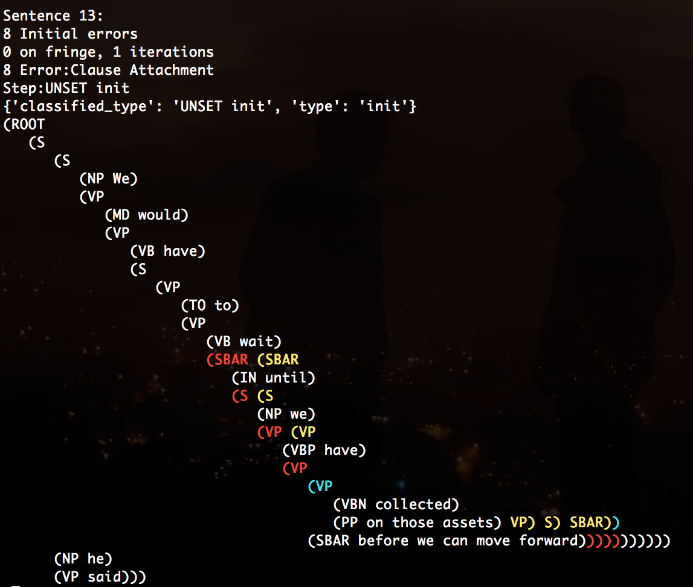

This software classifies mistakes in the output of parsers.  For a full description of the method, and discussion of results when applied to a range of well known parsers, see:

   [Parser Showdown at the Wall Street Corral: An Empirical Investigation of Error Types in Parser Output](https://aclweb.org/anthology/D/D12/D12-1096.pdf),
   Jonathan K. Kummerfeld, David Hall, James R. Curran, and Dan Klein,
   EMNLP 2012

   [An Empirical Examination of Challenges in Chinese Parsing](https://aclweb.org/anthology/P/P13/P13-2018.pdf),
   Jonathan K. Kummerfeld, Daniel Tse, James R. Curran, and Dan Klein,
   ACL (short) 2013

To use the system, download it one of these ways, and run as shown below:

- [Download .zip](https://github.com/jkkummerfeld/berkeley-parser-analyser/zipball/master)
- [Download .tar.gz](https://github.com/jkkummerfeld/berkeley-parser-analyser/tarball/master)
- `git clone https://github.com/jkkummerfeld/berkeley-parser-analyser.git`

If you use my code in your own work, please cite the following papers (for
English and Chinese respectively):

```
@InProceedings{Kummerfeld-etal:2012:EMNLP,
  author    = {Jonathan K. Kummerfeld  and  David Hall  and  James R. Curran  and  Dan Klein},
  title     = {Parser Showdown at the Wall Street Corral: An Empirical Investigation of Error Types in Parser Output},
  booktitle = {Proceedings of the 2012 Joint Conference on Empirical Methods in Natural Language Processing and Computational Natural Language Learning},
  address   = {Jeju Island, South Korea},
  month     = {July},
  year      = {2012},
  pages     = {1048--1059},
  software  = {https://github.com/jkkummerfeld/berkeley-parser-analyser},
  url       = {http://www.aclweb.org/anthology/D12-1096},
}

@InProceedings{Kummerfeld-etal:2013:ACL,
  author    = {Jonathan K. Kummerfeld  and  Daniel Tse  and  James R. Curran  and  Dan Klein},
  title     = {An Empirical Examination of Challenges in Chinese Parsing},
  booktitle = {Proceedings of the 51st Annual Meeting of the Association for Computational Linguistics (Volume 2: Short Papers)},
  address   = {Sofia, Bulgaria},
  month     = {August},
  year      = {2013},
  pages     = {98--103},
  software  = {https://github.com/jkkummerfeld/berkeley-parser-analyser},
  url       = {http://www.aclweb.org/anthology/P13-2018},
}
```

Here is an example of system output (red brackets are extra, blue are missing and yellow are crossing):



If you find a bug please submit an issue, and if you have a question please contact me.
I am not actively working on this project anymore, but will try to respond to feedback when possible.

## Running the System

There are four main programs:

- classify_english.py, Classify errors in English output
- classify_chinese.py, Classify errors in Chinese output
- print_coloured_errors.py, Print errors using colour in a plain text format (red for extra brackets, blue for missing brackets, yellow for crossing brackets, and white for correct brackets)
- reprint_trees.py, Reprint a set of trees in a different format (e.g. single line or multiline, plain text or latex), edits such as removing traces can also be applied

Running each with no arguments will provide help information.  Here are some example commands using the provided sample data:

```
English errors:
./berkeley_parse_analyser/classify_english.py sample_data/wsj01.mrg sample_data/berkeley.mrg classified.english.berkeley

Coloured errors:
./berkeley_parse_analyser/print_coloured_errors.py sample_data/wsj01.mrg sample_data/berkeley.mrg coloured_errors.english.berkeley
```

For the error analysis runs the files produced are:

- classified.berkeley.error_counts  -  The errors, their occurence, and the number of brackets attributed to them (frequency first, then number of brackets attributed)
- classified.berkeley.init_errors  -  A pretty-print presentation of the initial errors (red indicates extra spans, blue indicates missing spans, and yellow are missing spans that cross current spans)
- classified.berkeley.out  -  The complete output of the classification, including each step in each path
- classified.berkeley.log  -  A log of system notes
- classified.berkeley.test_trees  -  The test trees
- classified.berkeley.gold_trees  -  The gold trees

For the coloured output it can help to view the files as follows (with `-x3` to avoid the trees getting too wide):

```
less -x3 <filename>
```

##  Questions?

#### Q: How can I view the output files?

All of the output files are plain text. View their contents with tools like less, nano, or vim:

```
less <filename>
```

#### Q: How can I make a bar figure like in the papers?

In LaTeX, define these two lengths:

```
\setlength\fboxsep{0mm}
\setlength\fboxrule{0.05mm}
```

Then write this for each box, (it makes a thick horizontal rule, inside a frame box):
```
\framebox[8mm][l]{\rule{1.3mm}{2mm}}
```

Defining new commands can make it easier to create a whole lot of boxes:
```
\newcommand{\mybarheight}{2mm}
\newcommand{\myboxwidth}{8mm}
\newcommand{\mybar}[1]{\framebox[\myboxwidth][l]{\rule{#1mm}{\mybarheight}}}
```

And then write:
```
\mybar{1.30}
```

#### Q: What do I need to do to see the colours in the output files?

If you are not seeing colours when you look at the output files (e.g. by
running `less <filename>`) it may be because your terminal is not interpreting
raw [ANSI escape codes](http://en.wikipedia.org/wiki/ANSI_escape_code#Support).
For `less` this can be changed by passing the `-R` flag (or `-r`).

#### Q: Other questions?

Either open an issue or contact me! See [www.jkk.name](http://www.jkk.name) for my contact info.
